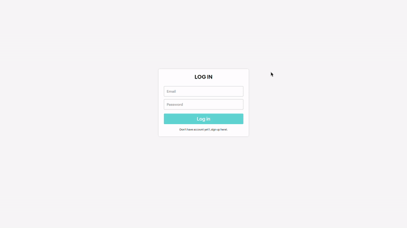
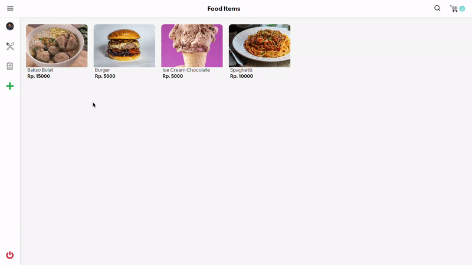
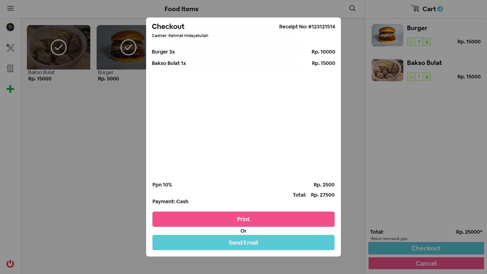

# Food Cashier (POS)


<p align="center">
  
</p>
<p align="center">
  Built with Vue Js.
</p>

## Table of Contents

- [Features](#features)
- [Requirements](#requirements)
- [Usage](#usage-for-development)
- [Create Environment Variable](#create-environment-variable)
- [Screenshots](#screenshots)
- [Contributing](#contributing)
- [Related Project](#related-project-backend)

## Features

- Users who are not logged in can only view the book
- Users must sign up and sign in to make a transaction and see their profiles
- And others

## Requirements

- Node.js - Download and Install [Node.js](https://nodejs.org/en/).
- Vue.js - Download and Install [Vue.js](https://vuejs.org/v2/guide/)

## Usage for development

1. Open your terminal or command prompt
2. Type `git clone https://github.com/HiRahmat-Dev/food-cashier-vuejs.git`
3. Open the folder and type `npm install` for install dependencies
4. Create Environment Variable [here](#create-environment-variable)
5. Before run this, you must run [backend first](#related-project-backend)
6. Type `npm run serve` for run this app.

## Create Environment Variable

```
$ touch .env.local
$ nano .env.local
```

```
VUE_APP_URL_API=YOUR_HOST_URL
VUE_APP_SECRET_KEY=YOUR_API_KEY
```

## Screenshots

<div align="center">
    <h4 align="center">LOGIN & REGISTER PAGE</h4>
    
    
</div>
<div align="center">
    <h4 align="center">DASHBOARD & CHECKOUT PAGE</h4>
       
    
</div>
<br>


## Contributing

Contributions are what make the open source community such an amazing place to be learn, inspire, and create. Any contributions you make are greatly appreciated.

Fork the Project
1. Create your Feature Branch  ```git checkout -b [feature]```
2. Commit your Changes ```git commit -m 'Add some feature'```
3. Push to the Branch ```git push origin [feature]```
4. Open a Pull Request


## Related Project (Backend)

* [`Backend-Food-Cashier`](https://github.com/HiRahmat-Dev/food-cashier-api)

